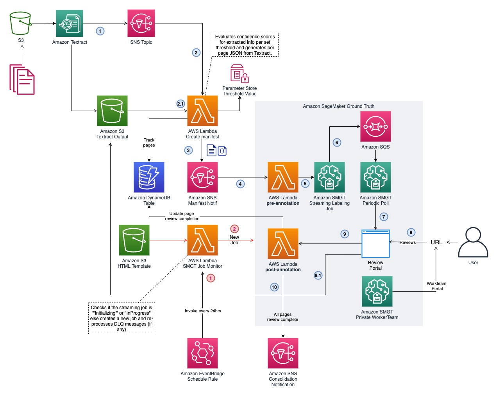

## Human in the loop for Amazon Textract Architecture

The solution for human-in-the-loop for Amazon Textract consists three sections-

1. An Amazon SageMaker GroundTruth [Streaming labeling job](https://docs.aws.amazon.com/sagemaker/latest/dg/sms-streaming-labeling-job.html).
2. An orchestration mechanism used to review the Amazon Textract outputs and send them to Amazon SageMaker Ground Truth.
3. A custom HITL reviewer portal template desined specifically to support PDF, TIF, PNG and JPG files.

## Architecture

The following diagram depicts the overall architecture of these two parts of the solution.



Notable components of the solution includes the following AWS resources -

1. An Amazon S3 Textract output bucket: This bucket must be used to store the Amazon Textract [Start Document Analysis](https://docs.aws.amazon.com/textract/latest/dg/API_StartDocumentAnalysis.html) or [Start Document Text detection](https://docs.aws.amazon.com/textract/latest/dg/API_StartDocumentTextDetection.html) API outputs. The bucket must be used directly in the `OutputConfig` parameter while making the API call.
2. An Amazon SNS topic: This SNS topic is used to receive Amazon Textract Async job status notification. When the Amazon Textract async job completes, a completion notification is sent to this SNS topic indicating that the Amazon Textract job is complete. This SNS must be used in the `NotificationChannel` parameter of the async API calls.
3. Create manifest AWS Lambda function: This Lambda function generates manifest files for Amazon SageMaker Ground Truth to consume. It evaluates the Amazon Textract output and looks for confidence scores for blocks that are below the defined confidence threshold. If lower confidence thresholds are found a manifest message is created for Sagemaker ground truth. In addition, this Lambda function performs the below tasks
   - Creates "per page" JSON from the raw output JSON from Amazon Textract. For multi-page files (PDF, TIF) each page will result in it's corresponding Amazon Textract JSON.
   - For each page in the document, it checks Amazon Textract block confidence with the confidence threshold
   - If lower confidence thresholds are found for a page, creates a manifest file for SageMaker ground truth for that specific page
   - Publishes the manifest message to the SageMaker Ground Truth streaming job SNS topic.
   - Tracks the document and page number sent to Ground Truth for human review in an Amazon DynamoDB table.
   - The [manifest message](./manifest-sample.jsonl) is of JSON Lines format and has a following structure
  ```jsonl
  {"source": "HITL Textract Review","fileExtension": "pdf","inputS3Prefix": "s3://my-bucket/groundtruth/document/pages/1","outputS3Prefix": "s3://my-bucket/groundtruth/document/pages/1/","numberOfPages": 1, "textractJobId": "xxxxxxxxxxxxxxxx","configuration": { "defaultConfidenceThreshold": 90 }}
  ```
4. The SNS topic for Ground Truth streaming lableing job: The ground truth streaming job receives manifest messages from this topic in step (3) of the diagram. 
5. [The pre-annotation Lambda function](https://docs.aws.amazon.com/sagemaker/latest/dg/sms-custom-templates-step3-lambda-requirements.html#sms-custom-templates-step3-prelambda): Once a manifest message is available, the pre-annotation Lambda function pre-processes the manifest message and constructs the message for Ground Truth human review task HTML template.
6. The pre-annotation Lambda hands over the message to SageMaker Ground Truth internal task queue at which point the review task is available for a human reviewer via the workteam portal for review.
7. The human reviewer, reviews the document and the low confidence threshold values from Textract for a given page of the document and completes the task. If there are multiple pages of the document in the task queue, all pages must be completed reviewing either by the same reviewer or other reviewers in the work team.
8. Once the review for a page is completed by the human reviewer, SageMaker ground truth places the resulting JSON back into the Amazon S3 bucket for post processing.
9. [The post-annotation Lambda function](https://docs.aws.amazon.com/sagemaker/latest/dg/sms-custom-templates-step3-lambda-requirements.html#sms-custom-templates-step3-postlambda): For each review completion (per page), SageMaker Ground Truth sends a completion message to the post-annotation Lambda function. This Lambda function updates the Amazon DynamoDB table for review completions of each page of the document. It also keeps track if all pages of the document are completed review and subsequently sends a completion notification to an SNS topic. This Lambda function also performs cleanup of some intermediary temporary files.
10. Customers may use the notification sent to this SNS topic to perform further post processing logic of the reviewed JSON.
11. The monitoring Lambda function: SageMaker Ground Truth streaming jobs are automatically terminated if there are no tasks send to it for 10 consecutive days. This monitoring Lambda runs on a periodic basis (every 24 hrs) to ensure that the stremaing labeling job is running and launches a new job to ensure that there's always a streaming job available to processing incoming human review tasks.


## Input and output structure

The input to the human review workflow begins with Amazon Textract async jobs writing the output into the provided Amazon S3 bucket. All, the intermediary files as well as the final output from the human review is written into the same bucket, but in a different _prefix_.

With the deployment of this solution, the S3 bucket will typically be named as `idp-textract-output-bucket-xxxxxxxxx` and the output of Amazon Textract is expected to be under a specific prefix example `output`. Both the bucket and output prefix can be specified in the Lambda function environment variables `TEXTRACT_OUTPUT_BKT` and `TEXTRACT_OUTPUT_PREFIX` for the process output Lambda function named as `idp-groundtruth-process-textract-output`. Make sure that the bucket and prefix are the exact same values used in the `OutputConfig` parameter of the Amazon Textract async API calls.

### Example

For an Amazon Textract [Start Document analysis](https://boto3.amazonaws.com/v1/documentation/api/latest/reference/services/textract/client/start_document_analysis.html) call with `OutputConfig` parmeter as below

```python
OutputConfig={
            'S3Bucket': 'idp-textract-output-bucket-abc-123-def',
            'S3Prefix': 'output'
    },
```

the output of the Amazon Textract async job will appear under `s3://idp-textract-output-bucket-abc-123-def/<textract-job-id>/`, where `<textract-job-id>` is the job ID generated by textract. Once the Job is complete generating the output, the output will be processed resulting in a new prefix named `pages/` being genertated. Considering a multi-page PDF document with 3 pages, the contents of `s3://idp-textract-output-bucket-abc-123-def/<textract-job-id>/pages/` would look like beow-

```
idp-textract-output-bucket-abc-123-def/<textract-job-id>/
├── pages/
│   ├── 1/
│   │   ├── page/
│   │   ├── textract-result/
│   │   └── human-annotation-results/
│   ├── 2/
│   │   ├── page/
│   │   ├── textract-result/
│   │   └── human-annotation-results/
│   └── 3/
│       ├── page/
│       ├── textract-result/
│       └── human-annotation-results/
├── .s3_access_check
├── 1
└── 2
```

The prefix `pages/` will contain individual prefixes per page number (depending on the total number of pages in the document, for PNG, and JPG it will always be `1`). Each page prefix (eg. `1/`, `2/`) will contain -

- The individual page (PDF, TIF, JPG, PNG) under the `page/` prefix
- The corresponding page's Textract JSON under the `textract-result/` prefix. This JSON is sent to SageMaker ground truth along with the page file from `page/` prefix for corrections/review.
- Once the review is complete, a new prefix named `human-annotation-results/` is created which will contain the reviewed JSON from Amazon SageMaker Ground Truth.

The reviewed JSON output from Amazon SageMaker Ground Truth is exactly the same fundamental structure as Amazon Textract Analyze Document and Detect Document Text schemas, along with some additional identifying attributes and metadata such as the `AdditionalHumanReviewInformation` and `JobId` attributes.

```json
{
    "AnalyzeDocumentModelVersion": "1.0",
    "Blocks": [...],
    "DocumentMetadata": {
        "Pages": 2
    },
    "JobStatus": "SUCCEEDED",
    "NextToken": null,
    "StatusMessage": null,
    "Warnings": null,
    "AdditionalHumanReviewInformation": {...},
    "JobId": "aa867485bb7406eef8c623c5e39ffafd68c5db2b564c58cf886c5db5c7d61374"
}
```

## Post processing human reviewed output

You can subscribe to the SNS topic (depicted in Step 10 of the architecture diagram) to get alerts on when a document review is complete. Once you recieve such notifications, you can kick-off any post processing mechanism by reading the output from the `human-annotation-results/` prefix. Keep in mind that each of these are individual page prefixes and it may be many pages under the same document depending on the total number of pages. So you must iterate over all the page prefixes (`1/`,`2/` and so on) to process the final reviewed output for each page under the `human-annotation-results/` prefix. The JSON structure is identical as the Amazon Textract JSON schema so your existing tooling for parsing the output should work. You may also look at using Amazon Textract output parser toolings such as [amazon-textract-response-parser](https://github.com/aws-samples/amazon-textract-response-parser/blob/master/src-python/README.md) and or [amazon-textract-textractor](https://github.com/aws-samples/amazon-textract-textractor).