# SMGT HITL Setting up Cognito User Pool and Workteam

## Get Started
This doc walks you through setting up the Cognito user pool and the creation of a private Ground Truth work team for reviewing Textract output. The creation of our private team is done after the deployment of the SMGT HITL stack which creates the necessary infrastructure as shown in the [reference architecture document](./architecture/README.md).  

To start clone CDK from here 
https://gitlab.aws.dev/intelligent-document-processing/idp-ai-human-in-loop

For more information on CDK deployment
https://docs.aws.amazon.com/cdk/v2/guide/getting_started.html


Follow instructions for bootstrapping your AWS account for CDK deployments.

[step-by-step instructions](README.md)
Run a CDK deploy from the app directory.

## Create Cognito User Pool
Following stack deployment, this is a quick walk through guide on creating required user pool and and private work team.
Once the Stack has finished deploying we need to setup a Cognito user pool. 
1. From the AWS main console navigate to the Cognito console and select Create user pool (do not select Federated identities).
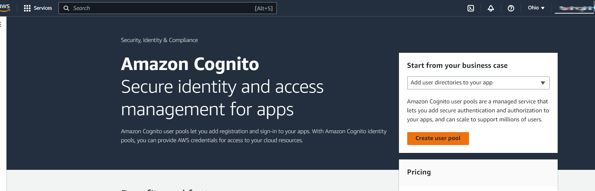

2. For user pool sign-in options select User Name and for user name requirements select make user name case sensitive, click next.
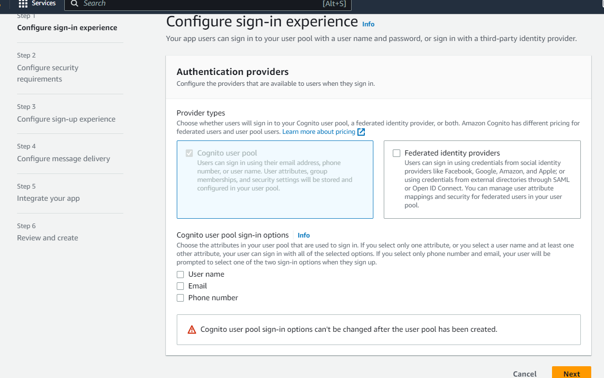

3. For password policy, leave as Cognito defaults. For multi factor select No MFA. Leave User account recovery with default settings.
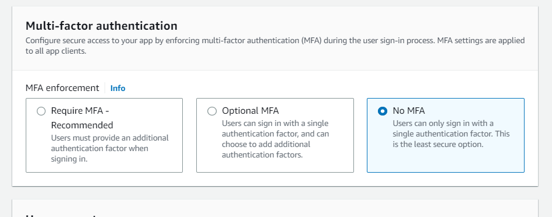

4. Next is Configure sign-up experience. Un-select Enable self-registration. Deselect Allow Cognito to automatically send messages. Skip required attributes and custom attributes and click on Next.
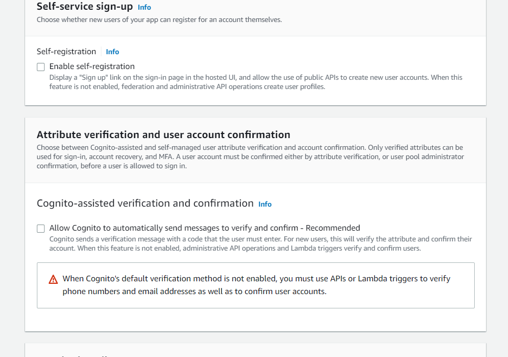

5. For Configure message delivery, select Send email with Cognito and click Next.
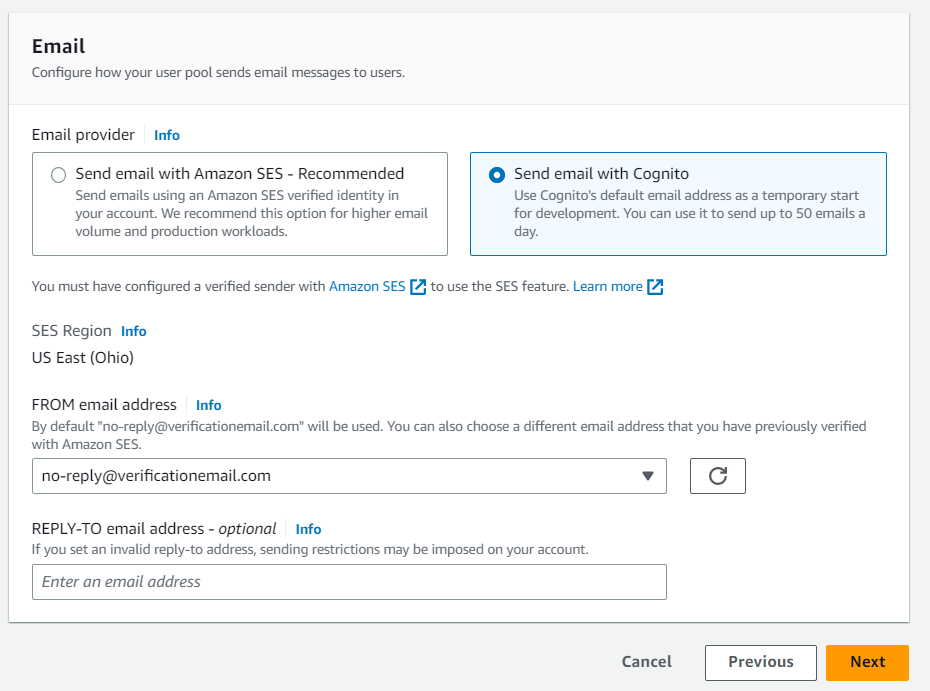

6. Next is Integrate your app. For user pool name, generate and provide a unique valid name.
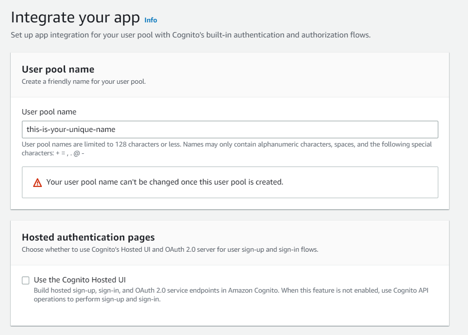

7. For app type select Other and then enter a valid app name.
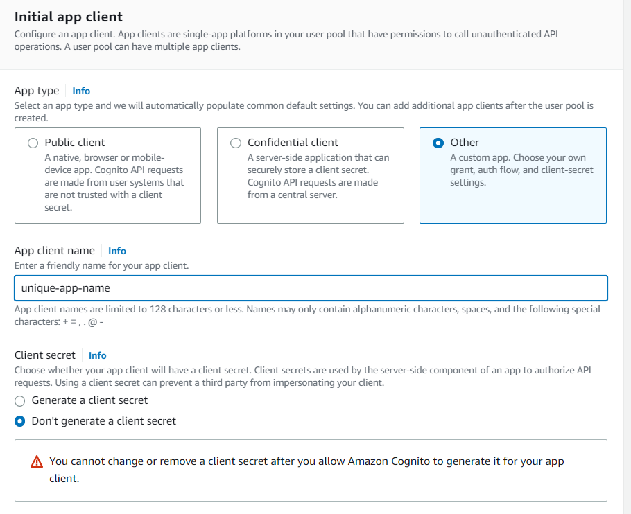

8. Click next and review your setup. Finally click on Create user pool.
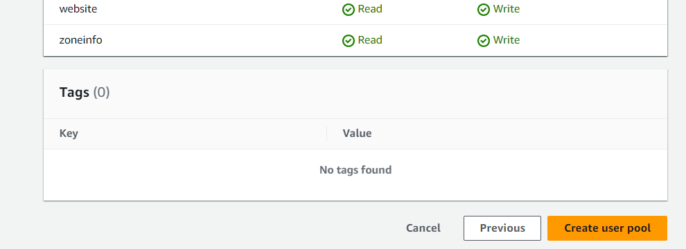
 
9. Once user pool is created we are going to create a user. Click on create user. Select Send email invitation and Enter your user information. Select generate password and click on create user. 
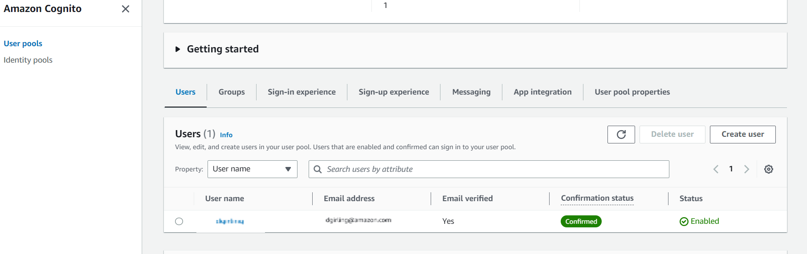


Shortly after creating user, check your users email as you will receive an email with your username and password.
Next we need to create a cognito group. 

10. Select the Groups tab and and click on create group. Enter a valid group name and click on create group. Once the group has been created you can navigate back to the user you created and add the user to this group.
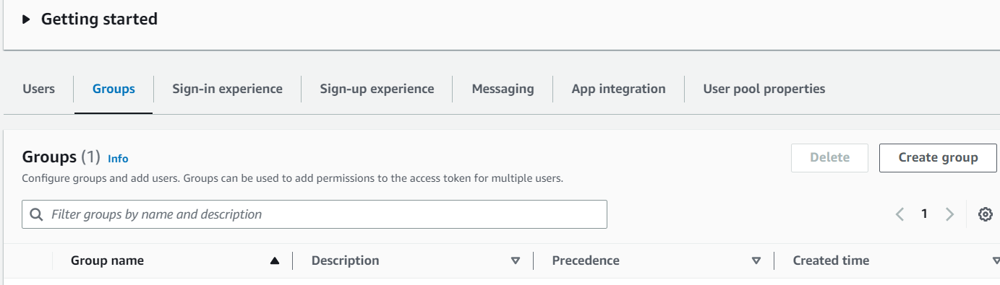

11. Next we need to create a Cognito domain. Navigate to the app integration tab and then under domain select create cognito domain and enter a valid domain name.

## Create Private Work Team In SageMaker
From here we are going to navigate from the main AWS console to Sagemaker where we are going to create a private workteam.

12. Select Labeling workforces from the Ground Truth menu and click on Create private team. Enter a valid unique team name.
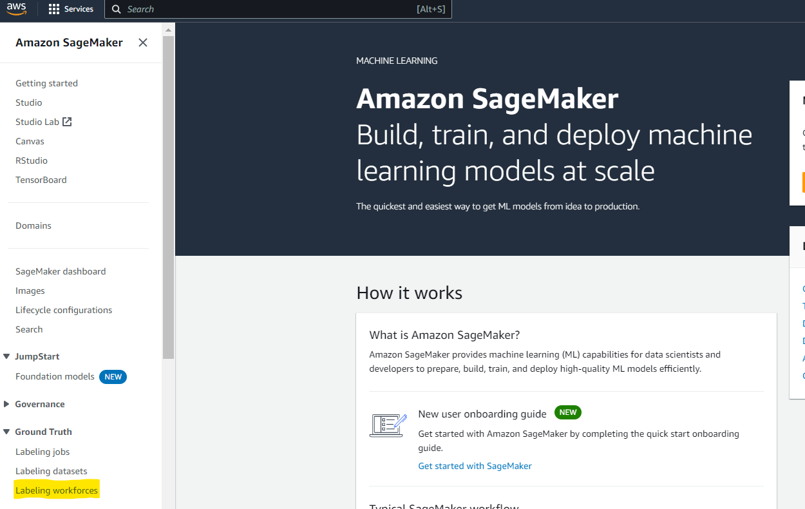
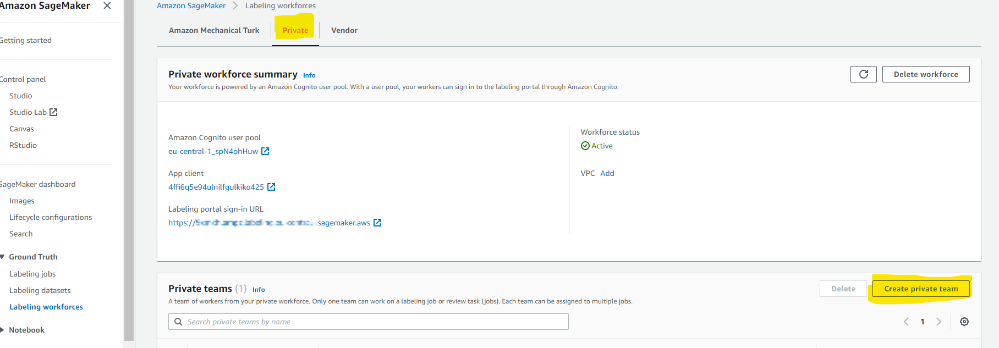

13. Select Import workers from existing Amazon Cognito user groups. From the dropdown select the Cognito user pool that you created in the previous step. 
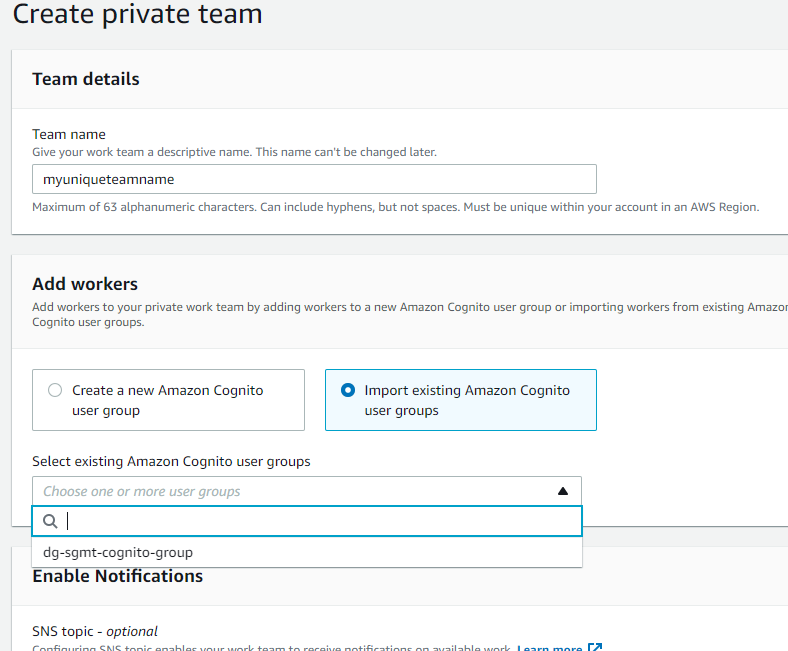

14. For app client select Sagemaker generated app client. 

15. From the drop down user groups, select the user group you created in the previous step.

## Start Labeling Job
Next step we need to do is create a labeling job, while this can be done manually, we are going to simplify by running the Lambda function idp-groundtruth-job-monitoring which will automatically create our labeling job. 

16. Navigate from the AWS console over to the Lambda dashboard. From your list of Lambda functions select the idp-groundtruth-job-monitoring Lambda. 
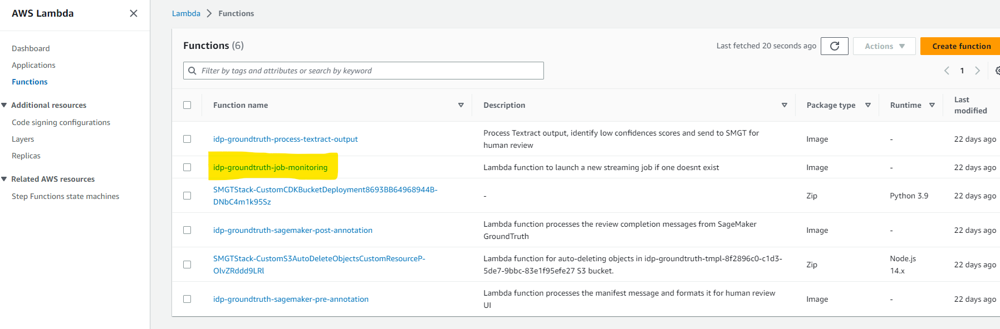

17. Click on the configuration tab and navigate to Environment variables. Before running this Lambda function we need to set the WORK_TEAM_ARN environmental variable. The ARN can be found in the Sagemaker under labeling workforce, private teams. Copy and paste the ARN for this private team into the Lambda environment variable and save. 
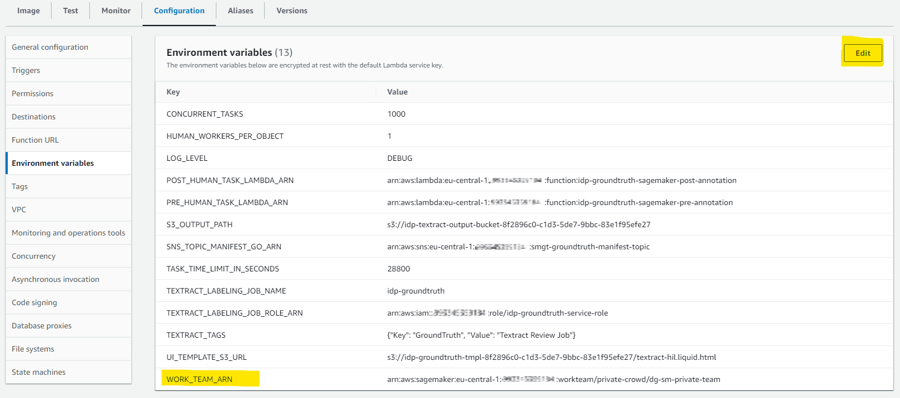
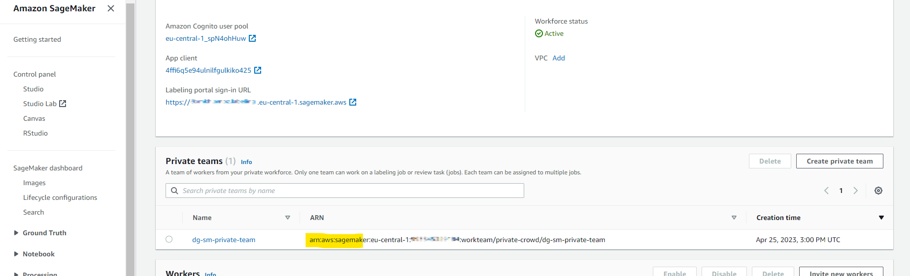

18. Next select test for the Lambda function, and run a test. Event information is not used, so go with default Event JSON for test. Once Lambda is executed a new labeling job in Sagemaker will be created.
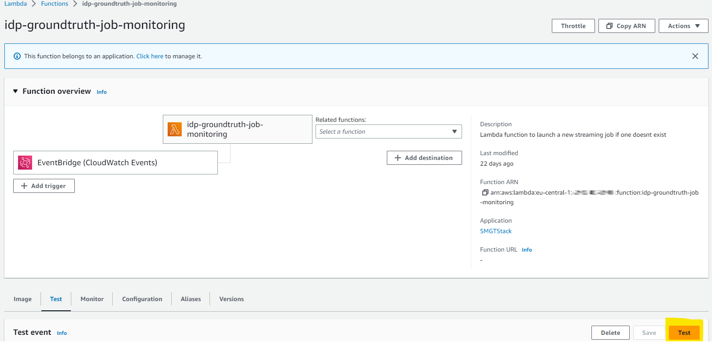

## Testing

Once the solution is deployed the architecture can be tested using Amazon Textract `start_document_analysis` API. When calling the start_document_analysis, its important to provide the API the ARN for the SNS topic and User role that was created during the stack deploy. You will need the output generated by the stack deployment to call the Amazon Textract API. Your stack deployment should display an output as seen in the following image-

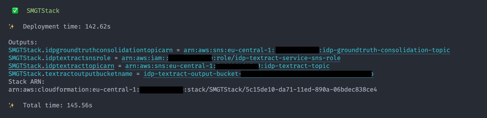

In the output above -

- `SMGTStack.idptextracttopicarn` is the SNS Topic ARN
- `SMGTStack.idptextractsnsrole` is the SNS Topic IAM Role
- `SMGTStack.textractoutputbucketname` is the Amazon S3 bucket created

You can use these values to test the solution. We have included a `test.sh` script which can be used to test documents. Before, running the test script you must upload sample documents to a prefix named `input/` in the S3 bucket created by our deployment. Once you have documents uploaded into the Amazon S3 bucket, execute the `test.sh` - 

```bash
chmod 755 ./test.sh

./test.sh -i <sns-iam-role> -s <sns-topic-arn> -b <s3-bucket-name> -r <region-name>
```

For the test script here are the flag definitions

- `-i` is the IAM Role for SNS Access eg. `arn:aws:iam::xxxxxxxxxxx:role/idp-textract-service-sns-role`
- `-s` is the SNS Topic ARN eg. `arn:aws:sns:us-east-1:xxxxxxxxx:idp-textract-topic`
- `-b` is the S3 bucket created eg. `idp-textract-output-bucket-xxxxxxxx`
- `-r` is the region name for eg. `us-east-1`

**NOTE**: The `test.sh` script assumes that your sample documents resides under a prefix named `input/` within the Amazon S3 bucket.

<!-- If you navigate to Amazon SNS and view topics, you will see “idp-textract-topic”. Make a note of the ARN for this topic, additionally navigate to IAM, under roles, search for “idp-textract-service-sns-role” and make a note of the ARN. Below you will find both a Python script and CLI command example to start a async job.

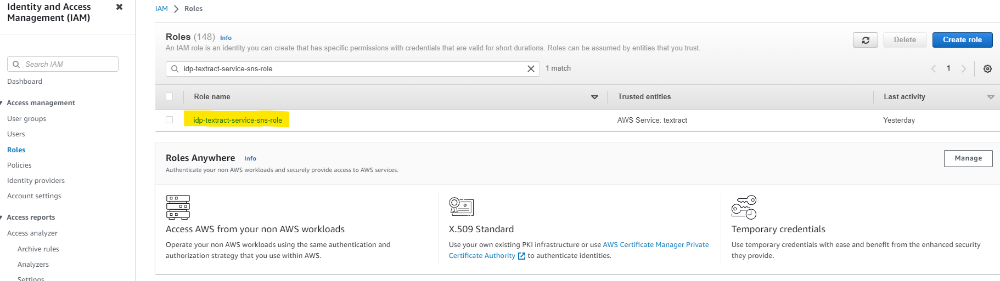
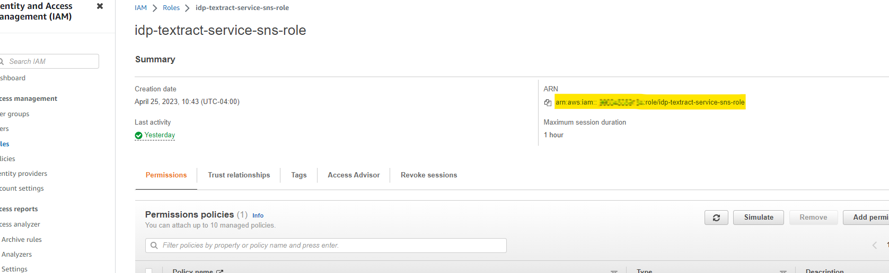 -->

Once the test script is executed and all the Amazon Textract jobs are done, the outputs will be generated under the prefix `output/` within the Amazon S3 bucket. If there are low score extractions in your documents that fall below the defined threshold, those documents will be sent to SageMaker GroundTruth for human review. Once the human review is complete the final output will be created under the same `output/` prefix under a `output/<job-id>/pages/<page-number>/page/` prefix. When the Textract Job is ran, post running, PDFs and TIFs will be split into single pages, where each  page along with its corresponding Amazon Textract JSON output will be sent to Amazon SageMaker GroundTruth if a confidence score is found on the page which is below the set threshold. For each of these pages, a labeling task is created in the SageMaker GroundTruth labeling jobs queue, and can be viewed for review from the _"Labeling portal"_.


## Document review completion notifications

As part of the stack deployment, an Amazon DynamoDB table is created. The table name is `idp-groundtruth-review-tracking`, and it is used to track individual pages associated to a review task that have had their review completed by a reviewer. For example if 5 pages from a PDF (or TIF) have been sent to GroundTruth, then a row will be inserted that will contain the Amazon Textract Job ID and the total number of pages sent to GroundTruth for review. As each page is reviewed and submitted by reviewers, the post annotation Lambda function will decrement this total pages count until zero is reached, this indicates that all 5 pages in this example have been reviewed. Once all pages are reviewed, the post-annotation Lambda will post a message into the `idp-groundtruth-consolidation-topic` with a status that Job ID # is completed. This SNS topic can easily be subscribed to, to fan out notifications for internal business process follow ups or subsequent downstream processing.
